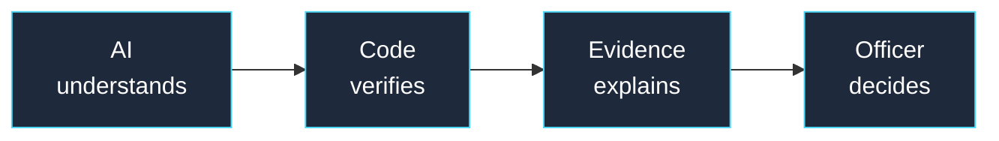
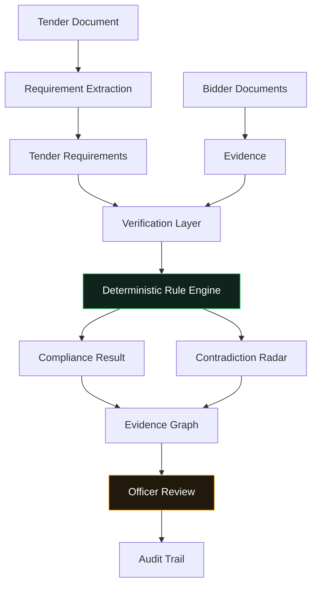

<div align="center">

# Saanron
### சான்றோன் — a person of virtue, integrity, and sound judgment

**AI-assisted, evidence-backed, tender-aware procurement compliance review**
*Built for Smart India Hackathon 2026 — Problem Statement 26100*

[](https://saanron.vercel.app)
[](https://saanron-backend.onrender.com/docs)
[]()
[](#license)

[](https://react.dev)
[](https://www.typescriptlang.org)
[](https://fastapi.tiangolo.com)
[](https://docs.pydantic.dev)
[](https://groq.com)

[Live Demo](https://saanron.vercel.app) · [API Documentation](https://saanron-backend.onrender.com/docs) · [Report an Issue](../../issues) · [Team](#team)

</div>

---

> **This is a hackathon prototype, not a production system.** Government verification sources (GST, PAN, Udyam, financial records, OEM authorization, debarment status) are mocked for demonstration purposes. No live government API is called. See [What's Mocked](#whats-mocked--whats-real) for the full breakdown.

---

## Table of Contents

- [The Problem](#the-problem)
- [Our Approach](#our-approach)
- [Key Features](#key-features)
- [How It Works](#how-it-works)
- [Tech Stack](#tech-stack)
- [Project Structure](#project-structure)
- [Getting Started](#getting-started)
- [Running Tests](#running-tests)
- [What's Mocked / What's Real](#whats-mocked--whats-real)
- [Roadmap](#roadmap)
- [Team](#team)
- [License](#license)

---

## The Problem

Government e-Marketplace (GeM) tenders are bid on by many companies at once. Before a contract is awarded, a procurement officer has to manually verify that the winning bidder is actually eligible — cross-referencing GST filings, PAN validity, Udyam/MSME registration, local-content requirements, OEM authorization, past debarment, and more.

GeM already verifies a seller's core details once, at registration. What it doesn't do is re-check whether that seller still meets the specific requirements of the specific tender they're bidding on — today, that gap is closed manually, tender by tender, document by document.

A busy officer scanning dozens of pages can miss a contradiction — like a bidder declaring ₹6.2 Cr in turnover on one document while their own audited financial statement says ₹4.8 Cr.

## Our Approach

Saanron is built around one strict separation of responsibility:



The AI never decides a compliance threshold. It reads and interprets. A deterministic rule engine makes every pass/fail call, on record, with every step traceable back to its source. The officer always makes the final decision — Saanron only ever recommends and shows the evidence behind that recommendation.

## Key Features

| Feature | What it does |
|---|---|
| Tender-Aware Requirement Extraction | Reads a tender document and extracts its specific eligibility requirements — not a generic checklist applied to every bid |
| Evidence Chain & Evidence Graph | Every result traces back through Clause → Requirement → Claim → Evidence → Verification → Rule → Result → Officer Action |
| Deterministic Compliance Engine | GST, PAN, Udyam, OEM authorization, local content, debarment, turnover, and certificate-validity checks — all rule-based, all explainable |
| Materiality Gaps | A failed numeric check shows how far the bidder is from compliant, not just pass/fail |
| Temporal Compliance | Checks whether a certificate was actually valid on the tender's closing date — not just "valid today" |
| Contradiction Radar | Surfaces discrepancies between a bidder's declarations and their verified evidence — flagged for investigation, never auto-judged |
| Reusable Bidder Evidence Passport | The same verified bidder evidence, evaluated against different tenders, can produce different — and correct — outcomes |
| Full Audit Trail | Every officer action is logged, timestamped, and traceable |
| Guided Demo Mode | A scripted walkthrough of the full workflow in under 90 seconds |
| Reset Demo | Restores a clean baseline for the next evaluator or session |

## How It Works



The signature demo moment: the same bidder, with the same verified evidence, evaluated against two different tenders with different turnover thresholds — producing two different, correct outcomes. That's not a coincidence of the data; it's the whole point. Compliance isn't a fixed label on a company — it's a relationship between that company and a specific tender's requirements.

## Tech Stack

**Frontend**
- React 19 + TypeScript
- Vite
- Tailwind CSS

**Backend**
- Python 3.11+ / FastAPI
- Pydantic v2 (strict schema contracts)

**AI / Documents**
- Groq (`openai/gpt-oss-20b`) for structured requirement extraction
- PyMuPDF for PDF text extraction
- PaddleOCR for scanned documents

**Graph & Visualization**
- NetworkX (contradiction/relationship analysis)
- React Flow (Evidence Graph rendering)

Note on persistence: the prototype currently uses an in-memory application state, seeded from fixture data, rather than a persistent database — intentional for a reliable, resettable public demo. The domain models are designed to move to a persistent store without changing the API contract.

## Project Structure

```text
saanron/
├── ai/                      # LLM extraction, contradiction detection, prompts
│   ├── extraction/
│   ├── prompts/
│   └── schemas/
├── backend/
│   └── app/
│       ├── api/             # FastAPI routes
│       ├── evidence/        # Evidence engine — lifecycle, not decisions
│       ├── models/          # Shared Pydantic domain schemas
│       ├── rules/           # Deterministic rule evaluators
│       ├── services/        # Adapters bridging AI and backend schemas
│       └── verification/    # Mock GST / PAN / Udyam / OEM / debarment connectors
├── frontend/
│   └── src/
│       ├── components/      # Overview, Compliance Matrix, Bidder Passport, Evidence Graph...
│       ├── services/        # API client
│       └── types/
├── data/
│   ├── fixtures/            # Seeded tenders, bidders, evidence
│   └── mock_sources/        # Synthetic government verification registry
├── docs/                    # Architecture and integration notes
└── tests/                   # Backend, AI, and integration test suites
```

## Getting Started

### Prerequisites
- Python 3.11+
- Node.js 20+

### Backend

```bash
cd backend
pip install -e ".[dev]"
uvicorn app.main:app --reload
```

Backend runs at `http://localhost:8000` — Swagger docs at `http://localhost:8000/docs`.

### Frontend

```bash
cd frontend
npm install
npm run dev
```

Frontend runs at `http://localhost:5173`.

### Environment variables

```bash
cp ai/.env.example ai/.env
# add your GROQ_API_KEY for live extraction (optional — demo mode works without it)
```

Live LLM extraction is an optional path. The core deterministic workflow — evaluation, evidence chain, contradiction detection, audit trail — runs entirely on seeded demo data with no API key required.

## Running Tests

```bash
# from the repository root
pytest
```

Covers the deterministic rule engine, evidence engine, verification connectors, compliance workflow, and AI extraction adapters.

## What's Mocked / What's Real

**Real:** requirement extraction logic, deterministic rule evaluation, evidence chain construction, contradiction detection, audit trail generation, the full FastAPI ↔ React data flow.

**Mocked:** GST / PAN / Udyam / OEM / debarment verification responses (synthetic registries standing in for live government APIs), tender and bidder documents (synthetic, GeM-format-realistic).

**Not implemented:** live government API integration, production authentication, a persistent database, multi-tenant/large-scale bidder history.

We'd rather be explicit about this than have a judge discover it — every mock in this codebase says so in its own docstring.

## Roadmap

- Resolve the live-extraction adapter gap for `OTHER`-typed requirement candidates
- Experience verification (multi-project, partial-match evaluation)
- Richer officer investigation workspace (mark for review / request clarification / resolve as a full workflow)
- Bidder 360 — cross-tender historical intelligence
- Authorized production integrations with real government verification APIs

## Team

AlgoRhythm — Smart India Hackathon 2026, Problem Statement 26100

## License

This project is licensed under the MIT License — see [`LICENSE`](LICENSE) for details.

---

<div align="center">

[back to top](#saanron)

</div>
